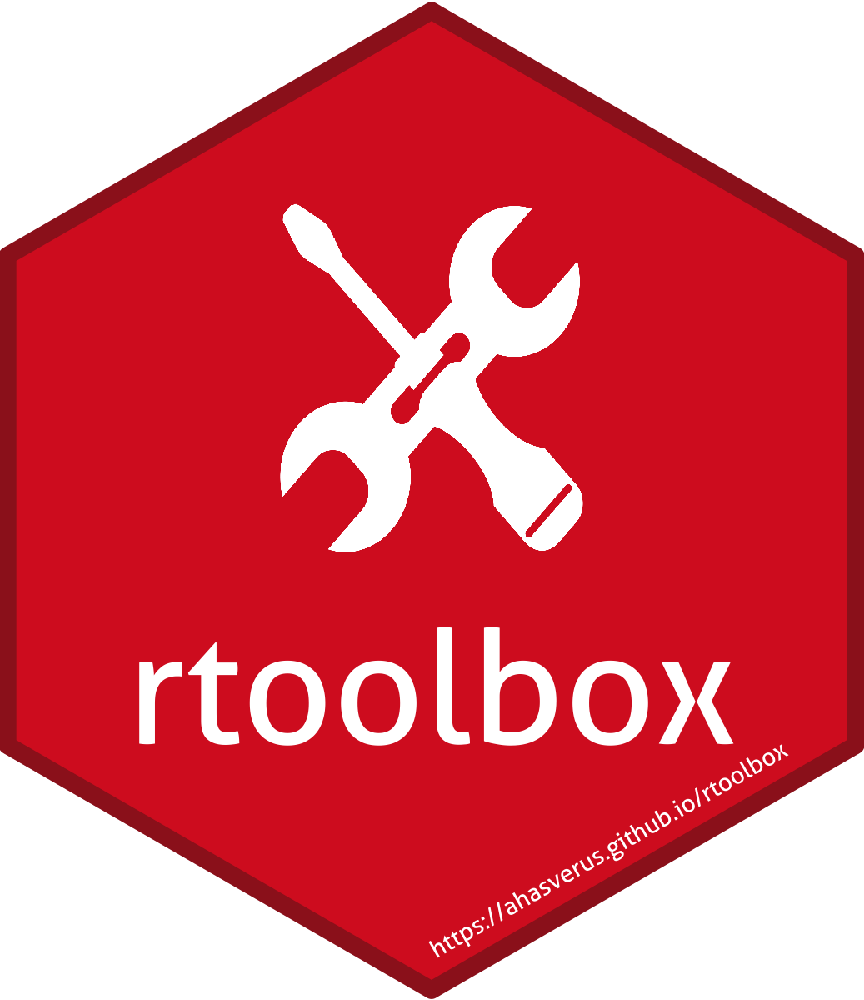

<!-- README.md is generated from README.Rmd. Please edit that file -->


```{r, include = FALSE}
knitr::opts_chunk$set(
  collapse  = TRUE,
  comment   = "#>",
  fig.path  = "man/figures/README-",
  out.width = "100%"
)
```


rtoolbox 
=========================================================


<!-- badges: start -->
[](https://github.com/ahasverus/rtoolbox/actions)
[](https://CRAN.R-project.org/package=rtoolbox)
[](https://www.gnu.org/licenses/old-licenses/gpl-2.0.en.html)
[](https://www.tidyverse.org/lifecycle/#experimental)
<!-- badges: end -->


A collection of miscellaneous R functions for everyday life.


## Installation

You can install the development version from [GitHub](https://github.com/) with:

```{r eval=FALSE}
# install.packages("remotes")
remotes::install_github("ahasverus/rtoolbox")
```

Then you can attach the package `rtoolbox`:

```{r eval=FALSE}
library("rtoolbox")
```


## Overview

Here is an overview of `rtoolbox` content:

| Function               | Description                                                                      |
| :--------------------- | :------------------------------------------------------------------------------- |
| `new_package()`        | Creates a new package structure (derived from `usethis::create_package()`)       |
| `new_compendium()`     | Creates a new compendium structure (derived from `rrtools::create_compendium()`) |
| `add_dependencies()`   | Adds automatically dependencies in **DESCRIPTION** file                          |
| `add_github_actions()` | Sets up GitHub Actions (derived from `usethis::use_github_action_*()`)           |
| `add_badges()`         | Adds common badges in **README.Rmd** (derived from `usethis::use_badge()`)       |
| `git_to_commit()`      | Checks if all local *git* repositories need to be updated                      |


## Citation

Please cite this package as: 

> Casajus N. (2021) rtoolbox: Utilitaries R Functions. R package version 1.0.0.


## Code of Conduct

Please note that the `rtoolbox` project is released with a 
[Contributor Code of Conduct](https://contributor-covenant.org/version/2/0/CODE_OF_CONDUCT.html). 
By contributing to this project, you agree to abide by its terms.

